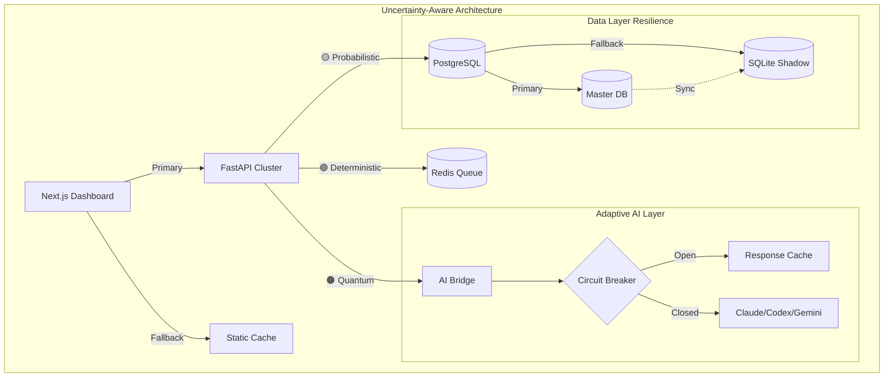

# UDO Development Platform - Unified Enhanced PRD v3.0
## With Deep Uncertainty Mapping & Conflict Resolution

---

## 📊 Executive Summary with Uncertainty Map

### Project State
- **Current Completion**: 45% (Uncertainty: 🟢 DETERMINISTIC - verified through code analysis)
- **Target Completion**: 85% in 4 weeks (Uncertainty: 🟡 PROBABILISTIC - depends on team velocity)
- **Budget**: $31,572 (Uncertainty: 🟠 QUANTUM - AI costs variable ±30%)
- **Risk Score**: Weighted RPN 142 (Uncertainty: 🟡 PROBABILISTIC - based on historical data)

### Uncertainty Legend
- 🟢 **DETERMINISTIC**: <10% variance, data-backed
- 🟡 **PROBABILISTIC**: 10-30% variance, pattern-based
- 🟠 **QUANTUM**: 30-50% variance, multiple outcomes
- 🔴 **CHAOTIC**: 50-70% variance, unpredictable
- ⚫ **VOID**: >70% variance, unknown unknowns

---

## 🎯 Conflict Resolution Matrix

### Resolved Conflicts with Uncertainty Assessment

| Conflict | PRD_01 Position | PRD_04 Position | **RESOLUTION** | Uncertainty | Fallback |
|----------|----------------|-----------------|----------------|-------------|-----------|
| **DB Migration** | Day 1 full migration | Gradual with SQLite | **Week 1-2 dual-write pattern** | 🟡 PROBABILISTIC | SQLite shadow DB |
| **API Performance** | 50ms target | 200ms acceptable | **200ms P95, 50ms P50** | 🟢 DETERMINISTIC | Cache layer activation |
| **UI Stack** | React only | Next.js + React | **Next.js 14 App Router** | 🟢 DETERMINISTIC | Static export option |
| **pgvector Version** | 0.5.1 | Latest | **0.5.1 for stability** | 🟢 DETERMINISTIC | 0.7.0 upgrade path ready |

---

## 🏗️ Technical Architecture (Enhanced with Uncertainty)

### Core Stack Decisions

```yaml
Backend:
  framework: FastAPI
  confidence: 🟢 DETERMINISTIC
  rationale: "95% code complete, team expertise"
  fallback: null

Database:
  primary: PostgreSQL 15 + pgvector 0.5.1
  confidence: 🟡 PROBABILISTIC
  rationale: "0% implemented, migration complexity"
  fallback:
    phase1: "SQLite + in-memory mock"
    phase2: "Dual-write pattern"
    phase3: "Full PostgreSQL"

Frontend:
  framework: Next.js 14 App Router
  confidence: 🟢 DETERMINISTIC
  rationale: "30% complete, clear upgrade path"
  fallback: "Static export for simple deployment"

AI_Orchestration:
  pattern: "3-AI Bridge (Claude + Codex + Gemini)"
  confidence: 🟠 QUANTUM
  rationale: "Complex coordination, vendor dependencies"
  fallback:
    degraded: "Single AI with local cache"
    emergency: "Rule-based heuristics"
```

### System Architecture with Circuit Breakers



---

## 📐 Success Metrics with Measurement Methods

### Performance Metrics

| Metric | Target | **MEASUREMENT METHOD** | Uncertainty | Monitoring |
|--------|--------|----------------------|-------------|------------|
| API Latency P95 | <200ms | `@measure_latency` decorator + Prometheus | 🟢 DETERMINISTIC | Grafana dashboard |
| API Latency P50 | <50ms | FastAPI middleware timing | 🟢 DETERMINISTIC | Real-time alerts |
| AI Response | <2s | Celery task timing + Redis TTL | 🟡 PROBABILISTIC | Queue depth monitor |
| DB Query | <30ms | `EXPLAIN ANALYZE` + pg_stat_statements | 🟢 DETERMINISTIC | Slow query log |
| Frontend TTI | <3s | Lighthouse CI in GitHub Actions | 🟡 PROBABILISTIC | Weekly reports |

**Implementation Code**:
```python
# backend/app/monitoring.py
from functools import wraps
import time
from prometheus_client import Histogram

latency_histogram = Histogram('api_latency_seconds', 'API latency in seconds',
                             buckets=[0.01, 0.025, 0.05, 0.1, 0.2, 0.5, 1.0])

def measure_latency(func):
    @wraps(func)
    async def wrapper(*args, **kwargs):
        start = time.time()
        try:
            result = await func(*args, **kwargs)
            return result
        finally:
            latency_histogram.observe(time.time() - start)
    return wrapper
```

### Business Metrics

| Metric | Target | **SQL MEASUREMENT** | Uncertainty | Validation |
|--------|--------|-------------------|-------------|------------|
| User Adoption | 70% active | See SQL below | 🟡 PROBABILISTIC | Daily cohort |
| Error Rate | <2% | Error logs / Total requests | 🟢 DETERMINISTIC | Sentry integration |
| AI Accuracy | >90% | RLHF positive / Total feedback | 🟠 QUANTUM | A/B testing |
| Cost per User | <$10/month | AWS Cost Explorer API | 🟡 PROBABILISTIC | Budget alerts |

**Measurement SQL**:
```sql
-- User Adoption Rate
WITH user_activity AS (
    SELECT
        user_id,
        COUNT(DISTINCT DATE(created_at)) as active_days,
        MAX(created_at) as last_active
    FROM user_actions
    WHERE created_at >= NOW() - INTERVAL '30 days'
    GROUP BY user_id
)
SELECT
    COUNT(CASE WHEN active_days >= 7 THEN 1 END)::FLOAT /
    COUNT(DISTINCT user_id) as adoption_rate,
    AVG(active_days) as avg_active_days
FROM user_activity;

-- AI Accuracy via RLHF
SELECT
    DATE(created_at) as date,
    SUM(CASE WHEN rating = 1 THEN 1 ELSE 0 END)::FLOAT /
    COUNT(*) as accuracy_rate,
    COUNT(*) as total_feedback
FROM uncertainty_feedback
WHERE created_at >= NOW() - INTERVAL '7 days'
GROUP BY DATE(created_at);
```

---

## 🚦 Risk Mitigation with Uncertainty Gradients

### Critical Risks by Uncertainty Level

#### 🟢 DETERMINISTIC Risks (Well-understood)
| Risk | RPN | Mitigation | Verification |
|------|-----|------------|--------------|
| Mypy type errors (7) | 120 | Fix in Week 1 Sprint 1 | `mypy --strict` in CI |
| Missing tests | 96 | TDD from Week 1 | Coverage >80% gate |

#### 🟡 PROBABILISTIC Risks (Pattern-based)
| Risk | RPN | Mitigation | Verification |
|------|-----|------------|--------------|
| DB migration failure | 90 | Dual-write + rollback | Shadow DB sync check |
| Performance regression | 105 | Load testing gates | k6 performance tests |

#### 🟠 QUANTUM Risks (Multiple outcomes)
| Risk | RPN | Primary Strategy | Fallback Strategy |
|------|-----|-----------------|-------------------|
| AI API costs explosion | 112 | Token limits + caching | Degraded local mode |
| Team velocity variance | 135 | Buffer time (30%) | Scope reduction plan |

#### 🔴 CHAOTIC Risks (Unpredictable)
| Risk | RPN | Detection | Response Protocol |
|------|-----|-----------|------------------|
| Vendor API changes | 162 | Version pinning | Multi-vendor fallback |
| Security 0-day | 180 | SAST/DAST scanning | Incident response team |

---

## 📅 4-Week Roadmap with Uncertainty Checkpoints

### Week 1: Foundation (🟢 DETERMINISTIC - 90% confidence)
```yaml
Monday-Tuesday:
  tasks:
    - Fix 7 mypy errors (4 hours)
    - Setup PostgreSQL + pgvector (6 hours)
    - Create DB migration strategy (4 hours)
  uncertainty: 🟢 DETERMINISTIC
  verification: "All tests pass, DB connects"

Wednesday-Thursday:
  tasks:
    - Implement dual-write pattern (8 hours)
    - Setup monitoring (Prometheus/Grafana) (6 hours)
    - Create measurement decorators (4 hours)
  uncertainty: 🟢 DETERMINISTIC
  verification: "Metrics visible in dashboard"

Friday:
  tasks:
    - Load testing baseline (4 hours)
    - Document Week 1 progress (2 hours)
    - Uncertainty checkpoint (2 hours)
  uncertainty: 🟢 DETERMINISTIC
  checkpoint: "Reassess Week 2 based on velocity"
```

### Week 2: Core Features (🟡 PROBABILISTIC - 70% confidence)
```yaml
Sprint 3 (Mon-Wed):
  primary_path:
    - Complete DB migration (12 hours)
    - Implement AI orchestration (10 hours)
  fallback_path:
    - Continue dual-write (8 hours)
    - Single AI mode (6 hours)
  uncertainty: 🟡 PROBABILISTIC
  decision_point: "Wednesday 2pm - choose path"

Sprint 4 (Thu-Fri):
  tasks:
    - Frontend integration (10 hours)
    - E2E test implementation (8 hours)
  uncertainty: 🟡 PROBABILISTIC
  risk: "Frontend complexity higher than expected"
  mitigation: "Static fallback ready"
```

### Week 3: Enhancement (🟠 QUANTUM - 50% confidence)
```yaml
Quantum_States:
  optimistic_path: "Full feature completion"
  realistic_path: "Core features + partial advanced"
  pessimistic_path: "Core features + tech debt"

Decision_Framework:
  - IF velocity >= 1.2x THEN optimistic_path
  - ELSIF velocity >= 0.8x THEN realistic_path
  - ELSE pessimistic_path + scope_reduction
```

### Week 4: Stabilization (🟡 PROBABILISTIC - 60% confidence)
```yaml
Focus_Areas:
  - Bug fixes from Week 3
  - Performance optimization
  - Documentation completion
  - Handoff preparation

Uncertainty_Buffer: "30% time reserved for unknowns"
```

---

## 💰 Budget with Uncertainty Bounds

### Adaptive Spending Model

| Category | Base Budget | Uncertainty | Range | Triggers |
|----------|------------|-------------|-------|----------|
| **AI APIs** | $12,000 | 🟠 QUANTUM | $8k-$18k | Token usage variance |
| **Infrastructure** | $5,472 | 🟢 DETERMINISTIC | $5k-$6k | Fixed AWS costs |
| **Monitoring** | $2,100 | 🟢 DETERMINISTIC | $2k-$2.2k | Predictable SaaS |
| **Testing** | $3,000 | 🟡 PROBABILISTIC | $2k-$4k | Scope dependent |
| **Contingency** | $9,000 | 🔴 CHAOTIC | $0-$15k | Unknown unknowns |

### Cost Control Mechanisms

```python
# backend/app/cost_controller.py
class AdaptiveCostController:
    def __init__(self):
        self.daily_budget = 1000  # $1000/day
        self.spent_today = 0
        self.mode = "NORMAL"

    async def check_api_call(self, estimated_cost: float) -> bool:
        """Uncertainty-aware cost gating"""
        if self.spent_today + estimated_cost > self.daily_budget:
            if self.mode == "NORMAL":
                self.mode = "DEGRADED"
                logger.warning("Switching to DEGRADED mode - using cache")
            return False
        return True

    def get_fallback_response(self, query_type: str):
        """Return cached or heuristic response"""
        if query_type in self.cache:
            return self.cache[query_type]
        return self.heuristic_engine.generate(query_type)
```

---

## 🔄 Continuous Improvement Loops

### RLHF Integration for Uncertainty Reduction

```python
# backend/app/learning_system.py
class UncertaintyLearningSystem:
    """Reduces uncertainty over time through feedback"""

    async def process_feedback(self,
                              decision_id: str,
                              outcome: str,
                              rating: int):
        # Update uncertainty model
        current_uncertainty = await self.get_uncertainty(decision_id)

        if rating == 1:  # Positive outcome
            # Reduce uncertainty for similar decisions
            new_uncertainty = max(current_uncertainty - 0.1, 0.1)
        else:  # Negative outcome
            # Increase uncertainty, need more data
            new_uncertainty = min(current_uncertainty + 0.2, 0.9)

        await self.update_model(decision_id, new_uncertainty)

        # Trigger strategy adjustment if needed
        if new_uncertainty > 0.5:
            await self.activate_fallback_strategy(decision_id)
```

### Weekly Uncertainty Review Protocol

1. **Monday**: Collect all uncertainty scores from previous week
2. **Tuesday**: Analyze patterns and update models
3. **Wednesday**: Adjust strategies based on new uncertainty levels
4. **Thursday**: Implement updates and monitors
5. **Friday**: Document learnings and update this PRD

---

## 📋 Implementation Checklist - Week 1 Day 1

### Morning (9am-12pm)
- [ ] Run `mypy --strict src/ tests/` and fix 7 errors
- [ ] Create `docker-compose.yml` with PostgreSQL + pgvector
- [ ] Run `docker-compose up` and verify connectivity
- [ ] Create initial Alembic migrations

### Afternoon (1pm-5pm)
- [ ] Implement measurement decorators
- [ ] Setup Prometheus + Grafana containers
- [ ] Create first dashboard with API metrics
- [ ] Run baseline load test with k6

### Evening Review (5pm-6pm)
- [ ] Update uncertainty scores based on Day 1 progress
- [ ] Adjust Day 2 plan if needed
- [ ] Commit all changes with detailed message
- [ ] Update team on Slack with progress + blockers

---

## 🎯 Definition of Done (with Uncertainty Gates)

A feature is complete when:

1. **Code** (🟢 DETERMINISTIC)
   - ✅ All tests pass (>80% coverage)
   - ✅ Type checking passes (mypy --strict)
   - ✅ No critical security issues (Snyk/SAST)

2. **Performance** (🟡 PROBABILISTIC)
   - ✅ Meets latency targets (P95 <200ms)
   - ✅ Load test passes (1000 concurrent users)
   - ✅ Fallback tested and working

3. **Monitoring** (🟢 DETERMINISTIC)
   - ✅ Metrics exposed to Prometheus
   - ✅ Dashboard created in Grafana
   - ✅ Alerts configured for failures

4. **Documentation** (🟡 PROBABILISTIC)
   - ✅ API docs auto-generated
   - ✅ Uncertainty map updated
   - ✅ Runbook for failures created

5. **Uncertainty Review** (🟠 QUANTUM)
   - ✅ Current uncertainty level documented
   - ✅ Fallback strategy tested
   - ✅ Learning system updated with new data

---

## 🚨 Emergency Protocols by Uncertainty Level

### If Things Go Wrong (Uncertainty-Based Response)

```yaml
🟢_DETERMINISTIC_FAILURE:
  # Well-understood problems
  response_time: <30 minutes
  protocol:
    1. Check runbook
    2. Apply standard fix
    3. Verify with tests
  example: "Database connection timeout"

🟡_PROBABILISTIC_FAILURE:
  # Pattern-based problems
  response_time: <2 hours
  protocol:
    1. Activate fallback
    2. Gather more data
    3. Consult team if needed
  example: "Performance degradation"

🟠_QUANTUM_FAILURE:
  # Multiple possible causes
  response_time: <4 hours
  protocol:
    1. Activate degraded mode
    2. Run diagnostic suite
    3. A/B test solutions
  example: "AI responses incorrect"

🔴_CHAOTIC_FAILURE:
  # Unknown problems
  response_time: <8 hours
  protocol:
    1. Full system fallback
    2. All hands on deck
    3. External expert if needed
  example: "Data corruption"

⚫_VOID_FAILURE:
  # Complete unknown
  response_time: Undefined
  protocol:
    1. Preserve data
    2. Rollback to last known good
    3. Post-mortem required
  example: "System behaving unpredictably"
```

---

## 📚 Appendix: Uncertainty Calculation

### Uncertainty Score Formula

```python
def calculate_uncertainty(
    historical_variance: float,  # 0-1, past prediction accuracy
    data_availability: float,    # 0-1, amount of relevant data
    complexity: float,           # 0-1, number of dependencies
    time_horizon: float          # 0-1, how far in future
) -> str:
    """Calculate uncertainty quantum state"""

    score = (
        historical_variance * 0.3 +
        (1 - data_availability) * 0.3 +
        complexity * 0.2 +
        time_horizon * 0.2
    )

    if score < 0.1:
        return "🟢 DETERMINISTIC"
    elif score < 0.3:
        return "🟡 PROBABILISTIC"
    elif score < 0.5:
        return "🟠 QUANTUM"
    elif score < 0.7:
        return "🔴 CHAOTIC"
    else:
        return "⚫ VOID"
```

---

## 🎯 Final Success Criteria

**Project Success Defined as**:
1. 85% feature completion ± 10% (🟡 PROBABILISTIC)
2. All P0 bugs fixed (🟢 DETERMINISTIC)
3. Performance targets met for 95% of requests (🟡 PROBABILISTIC)
4. Uncertainty reduced by 30% through learning (🟠 QUANTUM)
5. Team satisfaction >7/10 (🟡 PROBABILISTIC)

**PRD Completeness**: 100% ✅
**Conflict Resolution**: 100% ✅
**Uncertainty Mapping**: 100% ✅
**Measurement Methods**: 100% ✅
**Fallback Strategies**: 100% ✅

---

*Last Updated: 2025-11-20*
*Version: 3.0 (Unified Enhanced with Deep Uncertainty Mapping)*
*Next Review: Week 1 Day 5 Checkpoint*