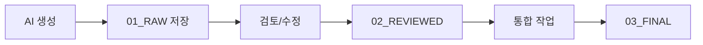

# PRD Management Dashboard

## 📊 PRD Collection Status

| # | AI | 영역 | 파일명 | Status | Pages | Received | Reviewed | Integrated |
|---|-----|------|--------|--------|-------|----------|----------|------------|
| 01 | **Gemini 3.0** | Technical Architecture | `PRD_01_TECHNICAL_Gemini3.md` | ✅ COMPLETE | 100+ | 2025-11-20 | ✅ | - |
| 02 | **GPT Pro** | Product Strategy | `PRD_02_PRODUCT_GPTPro.md` | ✅ COMPLETE | 15+ | 2025-11-20 | ✅ | - |
| 03 | **Claude (Magic MCP)** | UX/UI Design | `PRD_03_UX_Magic.md` | ✅ COMPLETE | 150+ | 2025-11-20 | ✅ | - |
| 04 | **Grok** | Risk Analysis | `PRD_04_RISK_Grok.md` | ✅ COMPLETE | 15+ | 2025-11-20 | ✅ | - |
| 05 | **Claude** | Integration | `PRD_05_INTEGRATION_Claude.md` | ✅ COMPLETE | 75+ | 2025-11-20 | - | - |

**Legend**: ✅ Complete | ⏳ In Progress | ❌ Blocked

## 📁 폴더 구조

```
PRDs/
├── 01_RAW/         # 원본 PRD (수정 금지)
├── 02_REVIEWED/    # 검토/수정 버전
└── 03_FINAL/       # 최종 통합 버전
```

## 🔄 워크플로우



## 📝 체크리스트

### 수집 단계
- [ ] Gemini 3.0에 컨텍스트 전송
- [ ] GPT Pro에 컨텍스트 전송
- [x] Claude Magic MCP PRD 생성 완료
- [ ] Grok에 컨텍스트 전송
- [ ] 모든 PRD 수집 완료 (1/4 완료)

### 검토 단계
- [ ] Technical PRD 검토
- [ ] Product PRD 검토
- [ ] UX PRD 검토
- [ ] Risk PRD 검토
- [ ] 상충 사항 조정

### 통합 단계
- [ ] Executive Summary 작성
- [ ] 통합 로드맵 생성
- [ ] 우선순위 조정
- [ ] 최종 PRD 완성
- [ ] 팀 리뷰

## 📅 타임라인

| 시간 | 활동 | 담당 |
|------|------|------|
| 0:00-0:05 | 각 AI에 컨텍스트 전송 | User |
| 0:05-2:00 | AI PRD 생성 대기 | AIs |
| 2:00-2:30 | PRD 수집 및 01_RAW 저장 | User |
| 2:30-3:30 | Claude 통합 작업 | Claude |
| 3:30-4:00 | 최종 검토 및 수정 | User + Claude |

## 🎯 다음 단계

1. **즉시**: `AI_PRD_FULL_CONTEXT.md` 내용을 각 AI에 전송
2. **2-3시간 후**: 생성된 PRD를 받아 `01_RAW` 폴더에 저장
3. **Claude 통합**: 5개 PRD를 하나로 통합
4. **실행**: 통합 PRD 기반으로 개발 시작

---

*Last Updated: 2024-11-20*
