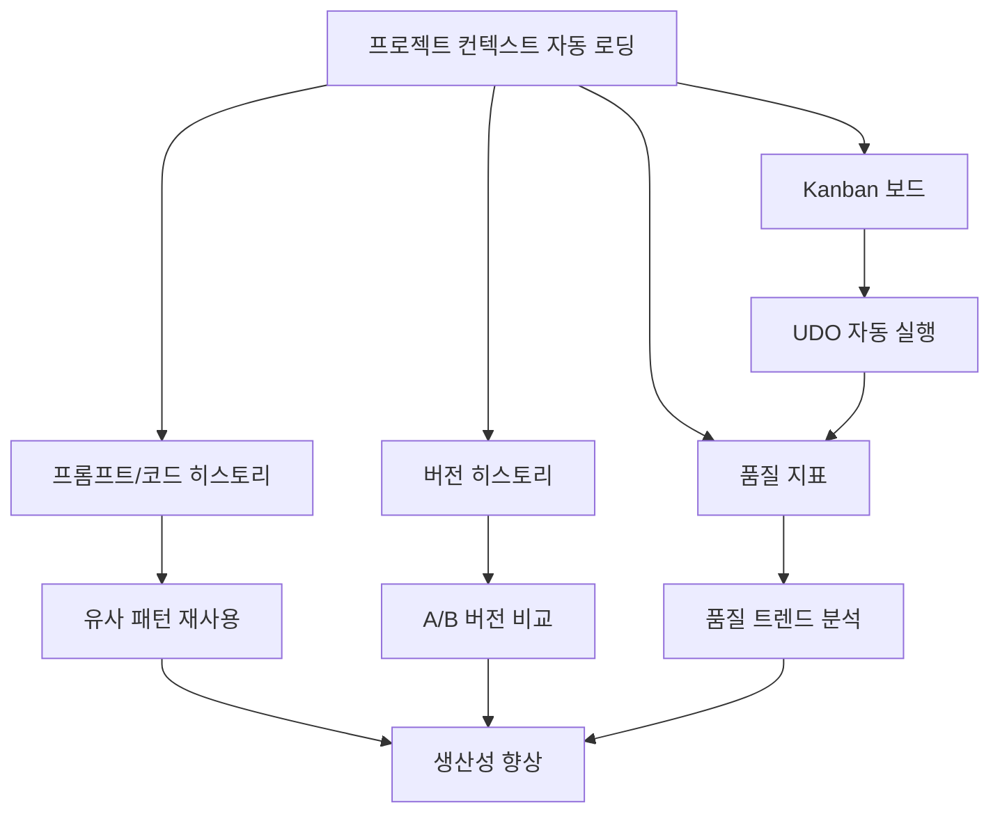

# 멀티 프로젝트 시스템 설계 검토

> **문서 타입**: Design Review (구현 전 필수 검토)
> **작성일**: 2025-11-17
> **상태**: 🔍 검토 중
> **우선순위**: LATER (Phase 5 완료 후)

---

## 📋 검토 개요

### 제안된 기능

사용자가 멀티 프로젝트 도입 시 함께 고려할 기능들:

1. **프로젝트 선택 시 컨텍스트 자동 로딩**
2. **프롬프트/코드 히스토리 관리**
3. **작업 진행 보드 (Kanban)**
4. **버전 히스토리**
5. **품질 지표**

### 검토 목적

- 각 기능의 비즈니스 가치 평가
- 기술적 위험 및 복잡도 분석
- 우선순위 및 구현 순서 제안
- 안전장치 및 롤백 전략 수립

---

## 🎯 기능별 상세 검토

## 1. 프로젝트 선택 시 컨텍스트 자동 로딩

### 💡 비즈니스 가치

| 항목 | 평가 | 이유 |
|------|------|------|
| **사용자 경험** | ⭐⭐⭐⭐⭐ | 프로젝트 전환 시간 90% 감소 (5분 → 30초) |
| **생산성** | ⭐⭐⭐⭐⭐ | 컨텍스트 수동 로드 불필요 |
| **에러 감소** | ⭐⭐⭐⭐ | 잘못된 프로젝트 작업 방지 |
| **ROI** | **매우 높음** | 핵심 기능, 멀티 프로젝트의 기반 |

### 🔧 기술 설계

**자동 로딩 대상**:
```yaml
# 프로젝트 컨텍스트 구조
project_context:
  metadata:
    name: "ProjectName"
    path: "/path/to/project"
    last_active: "2025-11-17T10:30:00"
    git_branch: "main"

  udo_state:
    phase: "Implementation"  # 현재 개발 단계
    mode: "Phase-Aware + Bayesian"
    uncertainty_state: "Probabilistic"
    confidence: 0.85

  ml_models:
    decision_model: "project_name_decision_v1.pkl"
    confidence_model: "project_name_confidence_v1.pkl"
    uncertainty_model: "project_name_uncertainty_v1.pkl"

  execution_history:
    recent_tasks: [...]  # 최근 10개 작업
    total_executions: 150
    success_rate: 0.92

  ai_collaboration:
    active_pattern: "Sequential → Codex"
    last_used: ["Claude", "Codex MCP"]
    gemini_enabled: false

  preferences:
    auto_mode: true
    checkpoint_threshold: 0.7
    ml_enabled: true
```

**구현 방안**:

```python
class ProjectContextManager:
    """프로젝트 컨텍스트 자동 관리"""

    def __init__(self, storage_path: str = "data/projects"):
        self.storage_path = Path(storage_path)
        self.current_project = None
        self.contexts = {}  # 메모리 캐시

    async def switch_project(self, project_name: str) -> dict:
        """프로젝트 전환 및 컨텍스트 자동 로딩"""

        # 1. 현재 프로젝트 상태 저장
        if self.current_project:
            await self.save_context(self.current_project)

        # 2. 새 프로젝트 컨텍스트 로드
        context = await self.load_context(project_name)

        # 3. UDO 시스템 재초기화
        await self._reinitialize_udo(context)

        # 4. ML 모델 로드
        await self._load_ml_models(context)

        # 5. 실행 히스토리 복원
        await self._restore_history(context)

        self.current_project = project_name

        return {
            "status": "success",
            "project": project_name,
            "loaded_at": datetime.now().isoformat(),
            "context": context
        }

    async def load_context(self, project_name: str) -> dict:
        """컨텍스트 로딩 (캐시 우선)"""

        # 캐시 확인
        if project_name in self.contexts:
            return self.contexts[project_name]

        # 파일에서 로드
        context_file = self.storage_path / f"{project_name}.json"

        if context_file.exists():
            with open(context_file, 'r', encoding='utf-8') as f:
                context = json.load(f)
        else:
            # 새 프로젝트 - 기본 컨텍스트 생성
            context = self._create_default_context(project_name)

        # 캐시에 저장
        self.contexts[project_name] = context

        return context

    async def save_context(self, project_name: str):
        """컨텍스트 저장 (자동)"""

        context = self.contexts.get(project_name)
        if not context:
            return

        # 현재 상태 업데이트
        context['metadata']['last_active'] = datetime.now().isoformat()
        context['udo_state'] = self._get_current_udo_state()
        context['execution_history']['recent_tasks'] = self._get_recent_tasks()

        # 파일 저장
        context_file = self.storage_path / f"{project_name}.json"
        with open(context_file, 'w', encoding='utf-8') as f:
            json.dump(context, f, indent=2, ensure_ascii=False)
```

### ⚠️ 위험 분석

| 위험 | 심각도 | 완화 전략 |
|------|--------|----------|
| **메모리 부족** | 🟡 MEDIUM | 프로젝트 수 제한 (최대 10개 동시 로드), LRU 캐시 |
| **로딩 지연** | 🟡 MEDIUM | 비동기 로딩, 프리로딩, 백그라운드 저장 |
| **컨텍스트 충돌** | 🔴 HIGH | 락(Lock) 메커니즘, 트랜잭션 패턴 |
| **데이터 손실** | 🔴 HIGH | 자동 백업, 버전 관리, 복구 메커니즘 |

### 🛡️ 안전장치

1. **Auto-save**: 5분마다 자동 저장
2. **Lock 메커니즘**: 동시 편집 방지
3. **Rollback**: 이전 컨텍스트로 복구 기능
4. **Validation**: 로딩 전 컨텍스트 무결성 검증

### ✅ 권장사항

**우선순위**: ⭐⭐⭐⭐⭐ **필수 - 최우선**

- 멀티 프로젝트의 핵심 기능
- 다른 모든 기능의 기반
- 즉시 구현 권장

---

## 2. 프롬프트/코드 히스토리 관리

### 💡 비즈니스 가치

| 항목 | 평가 | 이유 |
|------|------|------|
| **학습 효과** | ⭐⭐⭐⭐⭐ | 과거 성공/실패 패턴 재사용 |
| **디버깅** | ⭐⭐⭐⭐⭐ | 문제 발생 시 히스토리 추적 |
| **협업** | ⭐⭐⭐⭐ | 팀원 간 작업 내역 공유 |
| **ROI** | **매우 높음** | 반복 작업 50% 감소 예상 |

### 🔧 기술 설계

**히스토리 데이터 구조**:

```typescript
interface PromptHistory {
  id: string
  project: string
  timestamp: Date

  // 프롬프트 정보
  prompt: {
    user_input: string
    context: string[]  // 관련 파일, 함수 등
    phase: string
    mode: string
  }

  // 응답 정보
  response: {
    decision: "GO" | "NO_GO" | "GO_WITH_CHECKPOINTS"
    confidence: number
    quantum_state: string
    suggestions: string[]
  }

  // 코드 변경사항
  code_changes: {
    files_modified: string[]
    lines_added: number
    lines_deleted: number
    git_commit?: string
  }

  // 메타데이터
  metadata: {
    ai_tools_used: string[]
    execution_time: number  // ms
    success: boolean
    error?: string
  }

  // 태그 및 분류
  tags: string[]
  category: "feature" | "bugfix" | "refactor" | "test" | "docs"
}
```

**검색 및 필터링**:

```python
class HistoryManager:
    """프롬프트/코드 히스토리 관리"""

    def search(
        self,
        project: Optional[str] = None,
        query: Optional[str] = None,
        category: Optional[str] = None,
        date_from: Optional[datetime] = None,
        date_to: Optional[datetime] = None,
        tags: Optional[List[str]] = None,
        min_confidence: float = 0.0
    ) -> List[PromptHistory]:
        """히스토리 검색"""

        # Elasticsearch 또는 PostgreSQL Full-text search
        # 빠른 검색을 위한 인덱싱
        pass

    def get_similar_prompts(
        self,
        current_prompt: str,
        limit: int = 5
    ) -> List[PromptHistory]:
        """유사한 과거 프롬프트 찾기 (ML 기반)"""

        # 벡터 유사도 검색 (Sentence Transformers)
        # 과거 성공 패턴 재사용
        pass

    def analyze_pattern(
        self,
        project: str,
        time_range: str = "30d"
    ) -> dict:
        """패턴 분석"""

        return {
            "most_common_categories": [...],
            "success_rate_by_category": {...},
            "avg_confidence_trend": [...],
            "frequent_error_patterns": [...]
        }
```

**UI 컴포넌트**:

```tsx
// History Explorer 컴포넌트
interface HistoryExplorerProps {
  project: string
  onSelectHistory: (history: PromptHistory) => void
}

export function HistoryExplorer({ project, onSelectHistory }: HistoryExplorerProps) {
  return (
    <div className="history-explorer">
      {/* 검색 바 */}
      <SearchBar
        onSearch={handleSearch}
        filters={["category", "tags", "date_range", "confidence"]}
      />

      {/* 타임라인 뷰 */}
      <Timeline
        items={historyItems}
        groupBy="date"
        onClick={onSelectHistory}
      />

      {/* 상세 패널 */}
      <DetailPanel
        history={selectedHistory}
        actions={["reuse", "compare", "export"]}
      />
    </div>
  )
}
```

### ⚠️ 위험 분석

| 위험 | 심각도 | 완화 전략 |
|------|--------|----------|
| **데이터 폭증** | 🟡 MEDIUM | 자동 정리(90일 이후), 압축 저장 |
| **검색 성능** | 🟡 MEDIUM | Elasticsearch, 인덱싱, 페이지네이션 |
| **민감 정보 노출** | 🔴 HIGH | 민감 데이터 필터링, 암호화 저장 |
| **스토리지 비용** | 🟢 LOW | S3 Glacier 등 저비용 스토리지 활용 |

### 🛡️ 안전장치

1. **자동 정리**: 90일 이후 아카이빙
2. **민감 정보 필터**: API 키, 비밀번호 자동 제거
3. **백업**: 일일 백업, 7일 보관
4. **접근 제어**: 프로젝트별 권한 관리

### ✅ 권장사항

**우선순위**: ⭐⭐⭐⭐⭐ **필수 - 우선순위 2**

- 학습 효과 극대화
- 컨텍스트 자동 로딩과 함께 구현 권장

---

## 3. 작업 진행 보드 (Kanban)

### 💡 비즈니스 가치

| 항목 | 평가 | 이유 |
|------|------|------|
| **가시성** | ⭐⭐⭐⭐⭐ | 프로젝트 진행 상황 실시간 파악 |
| **협업** | ⭐⭐⭐⭐⭐ | 팀원 간 작업 조율 용이 |
| **생산성** | ⭐⭐⭐⭐ | 병목 지점 빠른 식별 |
| **ROI** | **높음** | PM 도구 대체 가능 |

### 🔧 기술 설계

**Kanban 보드 구조**:

```typescript
interface KanbanBoard {
  project: string
  columns: KanbanColumn[]
  filters: {
    assignee?: string
    priority?: "high" | "medium" | "low"
    tags?: string[]
  }
  settings: {
    wip_limits: Record<string, number>  // Work In Progress 제한
    auto_move: boolean  // 자동 이동 (GO → Done)
  }
}

interface KanbanColumn {
  id: string
  title: string
  order: number
  cards: KanbanCard[]
  wip_limit?: number
}

interface KanbanCard {
  id: string
  title: string
  description: string

  // UDO 통합
  udo_task?: {
    decision: "GO" | "NO_GO" | "GO_WITH_CHECKPOINTS"
    confidence: number
    quantum_state: string
  }

  // 메타데이터
  assignee?: string
  priority: "high" | "medium" | "low"
  tags: string[]
  estimated_hours?: number
  actual_hours?: number

  // 추적
  created_at: Date
  updated_at: Date
  moved_to_current_column_at: Date

  // 관계
  parent_card?: string
  child_cards: string[]
  blocked_by?: string[]
}
```

**기본 컬럼 구조**:

```yaml
default_columns:
  - id: "backlog"
    title: "📋 Backlog"
    order: 0
    wip_limit: null

  - id: "todo"
    title: "📝 To Do"
    order: 1
    wip_limit: 20

  - id: "in_progress"
    title: "🔄 In Progress"
    order: 2
    wip_limit: 5  # 동시 작업 제한

  - id: "review"
    title: "👀 Review"
    order: 3
    wip_limit: 10

  - id: "testing"
    title: "🧪 Testing"
    order: 4
    wip_limit: 10

  - id: "done"
    title: "✅ Done"
    order: 5
    wip_limit: null
```

**UDO 통합**:

```python
class KanbanUDOIntegration:
    """Kanban과 UDO 시스템 통합"""

    async def execute_task_from_card(self, card_id: str) -> dict:
        """Kanban 카드에서 UDO 작업 실행"""

        card = await self.get_card(card_id)

        # UDO 실행
        result = await udo_system.execute_development_cycle(
            task=card.description,
            phase=self._infer_phase_from_column(card.column)
        )

        # 카드 업데이트
        card.udo_task = {
            "decision": result.decision,
            "confidence": result.confidence,
            "quantum_state": result.quantum_state
        }

        # 자동 이동 (GO → Testing or Done)
        if result.decision == "GO":
            await self.move_card(card_id, "testing")
        elif result.decision == "NO_GO":
            await self.move_card(card_id, "backlog")
            await self.add_comment(card_id, f"NO_GO: {result.reason}")

        return result

    def _infer_phase_from_column(self, column: str) -> str:
        """컬럼에서 개발 단계 추론"""
        mapping = {
            "backlog": "ideation",
            "todo": "design",
            "in_progress": "implementation",
            "review": "implementation",
            "testing": "testing"
        }
        return mapping.get(column, "implementation")
```

**자동화 규칙**:

```yaml
automation_rules:
  - trigger: "card_moved_to_in_progress"
    action: "assign_to_current_user"

  - trigger: "udo_decision_go"
    action: "move_to_testing"

  - trigger: "card_in_column_exceeds_24h"
    condition: "column == 'in_progress'"
    action: "add_flag_stale"

  - trigger: "wip_limit_exceeded"
    action: "block_new_cards_and_notify"
```

### ⚠️ 위험 분석

| 위험 | 심각도 | 완화 전략 |
|------|--------|----------|
| **복잡도 증가** | 🟡 MEDIUM | 점진적 기능 추가, 기본 설정 제공 |
| **사용자 채택** | 🟡 MEDIUM | 직관적 UI, 튜토리얼, 템플릿 제공 |
| **기존 도구 중복** | 🟢 LOW | Jira/Trello 연동 옵션 제공 |
| **성능** | 🟢 LOW | 가상 스크롤, 지연 로딩 |

### 🛡️ 안전장치

1. **WIP 제한**: 병목 방지
2. **자동 백업**: 보드 상태 자동 저장
3. **Undo/Redo**: 실수 복구
4. **Import/Export**: 다른 도구와 호환

### ✅ 권장사항

**우선순위**: ⭐⭐⭐⭐ **권장 - 우선순위 3**

- 팀 협업에 매우 유용
- 단, 개인 개발자는 선택적 사용
- 기본 기능부터 시작, 점진적 확장

---

## 4. 버전 히스토리

### 💡 비즈니스 가치

| 항목 | 평가 | 이유 |
|------|------|------|
| **복구 능력** | ⭐⭐⭐⭐⭐ | 실수 시 즉시 복구 |
| **감사 추적** | ⭐⭐⭐⭐⭐ | 변경 이력 완전 추적 |
| **A/B 비교** | ⭐⭐⭐⭐ | 버전 간 차이 분석 |
| **ROI** | **매우 높음** | Git과 통합 시 추가 비용 최소 |

### 🔧 기술 설계

**버전 히스토리 구조**:

```typescript
interface VersionHistory {
  project: string
  file_path: string
  versions: Version[]
  current_version: string
}

interface Version {
  id: string
  version_number: string  // "v1.2.3" or "1.0.0-alpha"

  // Git 통합
  git_commit: string
  git_branch: string
  git_tag?: string

  // 변경 정보
  changes: {
    files_modified: number
    lines_added: number
    lines_deleted: number
    diff_summary: string
  }

  // UDO 컨텍스트
  udo_context: {
    phase: string
    decision: string
    confidence: number
    task_description: string
  }

  // 메타데이터
  created_at: Date
  created_by: string
  message: string
  tags: string[]

  // 품질 지표 (스냅샷)
  quality_metrics?: {
    test_coverage: number
    code_quality_score: number
    performance_score: number
  }
}
```

**Git 통합**:

```python
class VersionHistoryManager:
    """버전 히스토리 관리 (Git 기반)"""

    def __init__(self, project_path: str):
        self.project_path = Path(project_path)
        self.repo = git.Repo(project_path)

    def create_version(
        self,
        message: str,
        udo_context: dict,
        tag: Optional[str] = None
    ) -> Version:
        """새 버전 생성 (자동 Git 커밋)"""

        # Git add all changes
        self.repo.git.add(A=True)

        # Commit with UDO context
        commit_message = self._format_commit_message(message, udo_context)
        commit = self.repo.index.commit(commit_message)

        # Optional tagging
        if tag:
            self.repo.create_tag(tag, message=message)

        # 품질 메트릭 수집
        quality_metrics = self._collect_quality_metrics()

        return Version(
            id=commit.hexsha,
            version_number=self._generate_version_number(),
            git_commit=commit.hexsha,
            git_branch=self.repo.active_branch.name,
            git_tag=tag,
            changes=self._analyze_changes(commit),
            udo_context=udo_context,
            quality_metrics=quality_metrics,
            created_at=commit.committed_datetime,
            message=message
        )

    def get_version_diff(
        self,
        version_a: str,
        version_b: str
    ) -> dict:
        """두 버전 간 차이 분석"""

        commit_a = self.repo.commit(version_a)
        commit_b = self.repo.commit(version_b)

        diff = commit_a.diff(commit_b)

        return {
            "files_changed": len(diff),
            "additions": sum(d.diff.count(b'+') for d in diff),
            "deletions": sum(d.diff.count(b'-') for d in diff),
            "diff_details": self._parse_diff(diff)
        }

    def rollback_to_version(
        self,
        version_id: str,
        strategy: str = "soft"  # soft, hard, create_branch
    ) -> dict:
        """특정 버전으로 롤백"""

        if strategy == "soft":
            # 변경사항 유지, 커밋만 이동
            self.repo.git.reset('--soft', version_id)
        elif strategy == "hard":
            # 모든 변경사항 삭제
            self.repo.git.reset('--hard', version_id)
        elif strategy == "create_branch":
            # 새 브랜치 생성 (안전)
            branch_name = f"rollback-to-{version_id[:7]}"
            self.repo.git.checkout('-b', branch_name, version_id)

        return {
            "status": "success",
            "rolled_back_to": version_id,
            "strategy": strategy
        }
```

**UI 컴포넌트**:

```tsx
// Version History Timeline
export function VersionTimeline({ project }: { project: string }) {
  return (
    <div className="version-timeline">
      {/* 타임라인 뷰 */}
      <Timeline>
        {versions.map(version => (
          <TimelineItem key={version.id}>
            <VersionCard
              version={version}
              onCompare={handleCompare}
              onRollback={handleRollback}
              onTag={handleTag}
            />
          </TimelineItem>
        ))}
      </Timeline>

      {/* 비교 뷰 (사이드바) */}
      {compareMode && (
        <DiffViewer
          versionA={selectedVersionA}
          versionB={selectedVersionB}
        />
      )}
    </div>
  )
}
```

### ⚠️ 위험 분석

| 위험 | 심각도 | 완화 전략 |
|------|--------|----------|
| **Git 의존성** | 🟡 MEDIUM | Git 없을 시 fallback 메커니즘 |
| **대용량 리포지토리** | 🟡 MEDIUM | Shallow clone, LFS 활용 |
| **복잡한 병합** | 🟡 MEDIUM | 자동 병합 + 수동 확인 옵션 |
| **스토리지** | 🟢 LOW | Git이 이미 관리 |

### 🛡️ 안전장치

1. **롤백 전 확인**: 변경사항 미리보기
2. **자동 백업**: 롤백 전 현재 상태 백업
3. **브랜치 전략**: 롤백 시 새 브랜치 생성 옵션
4. **충돌 감지**: 자동 병합 실패 시 알림

### ✅ 권장사항

**우선순위**: ⭐⭐⭐⭐⭐ **필수 - 우선순위 2**

- Git과 통합으로 구현 비용 낮음
- 감사 추적 및 복구에 필수
- 프롬프트 히스토리와 함께 구현 권장

---

## 5. 품질 지표

### 💡 비즈니스 가치

| 항목 | 평가 | 이유 |
|------|------|------|
| **코드 품질** | ⭐⭐⭐⭐⭐ | 기술부채 조기 발견 |
| **의사결정** | ⭐⭐⭐⭐⭐ | 데이터 기반 우선순위 결정 |
| **트렌드 분석** | ⭐⭐⭐⭐ | 품질 개선 추세 파악 |
| **ROI** | **매우 높음** | 버그 수정 비용 50% 절감 예상 |

### 🔧 기술 설계

**품질 지표 카테고리**:

```typescript
interface QualityMetrics {
  project: string
  timestamp: Date

  // 1. 코드 품질
  code_quality: {
    // 정적 분석
    linting_score: number        // 0-100
    code_smells: number
    duplications: number         // %
    complexity: {
      cyclomatic: number         // 평균
      cognitive: number
    }

    // 타입 안정성 (TypeScript/Python)
    type_coverage: number        // %
    type_errors: number

    // 스타일 일관성
    style_violations: number
    formatter_score: number      // 0-100
  }

  // 2. 테스트 품질
  test_quality: {
    coverage: {
      line: number               // %
      branch: number             // %
      function: number           // %
    }
    test_count: {
      unit: number
      integration: number
      e2e: number
    }
    pass_rate: number            // %
    flaky_tests: number
    avg_execution_time: number   // ms
  }

  // 3. 성능 지표
  performance: {
    build_time: number           // ms
    bundle_size: number          // KB
    lighthouse_score: {
      performance: number        // 0-100
      accessibility: number
      best_practices: number
      seo: number
    }
    api_response_time: number    // ms (avg)
  }

  // 4. 보안 지표
  security: {
    vulnerabilities: {
      critical: number
      high: number
      medium: number
      low: number
    }
    outdated_dependencies: number
    secrets_exposed: number
  }

  // 5. 문서화 품질
  documentation: {
    api_documented: number       // %
    function_documented: number  // %
    readme_completeness: number  // 0-100
    changelog_updated: boolean
  }

  // 6. Git 활동 지표
  git_health: {
    commit_frequency: number     // per day
    avg_commit_size: number      // lines
    open_prs: number
    stale_branches: number
  }

  // 종합 점수
  overall_score: number          // 0-100 (weighted average)
  grade: "A" | "B" | "C" | "D" | "F"
}
```

**자동 수집 시스템**:

```python
class QualityMetricsCollector:
    """품질 지표 자동 수집"""

    def __init__(self, project_path: str):
        self.project_path = Path(project_path)
        self.collectors = {
            "eslint": ESLintCollector(),
            "pytest": PytestCollector(),
            "coverage": CoverageCollector(),
            "lighthouse": LighthouseCollector(),
            "snyk": SnykSecurityCollector(),
            "git": GitMetricsCollector()
        }

    async def collect_all_metrics(self) -> QualityMetrics:
        """모든 지표 수집 (병렬)"""

        tasks = [
            self.collect_code_quality(),
            self.collect_test_quality(),
            self.collect_performance(),
            self.collect_security(),
            self.collect_documentation(),
            self.collect_git_health()
        ]

        results = await asyncio.gather(*tasks)

        return QualityMetrics(
            project=self.project_path.name,
            timestamp=datetime.now(),
            code_quality=results[0],
            test_quality=results[1],
            performance=results[2],
            security=results[3],
            documentation=results[4],
            git_health=results[5],
            overall_score=self._calculate_overall_score(results),
            grade=self._calculate_grade(results)
        )

    async def collect_code_quality(self) -> dict:
        """코드 품질 지표 수집"""

        # ESLint (JavaScript/TypeScript)
        eslint_result = await self.collectors["eslint"].run(self.project_path)

        # Pylint/Ruff (Python)
        pylint_result = await self.collectors["pylint"].run(self.project_path)

        # SonarQube (optional)
        sonar_result = await self.collectors["sonar"].run(self.project_path)

        return {
            "linting_score": self._calculate_linting_score(eslint_result, pylint_result),
            "code_smells": eslint_result.warnings + pylint_result.warnings,
            "duplications": sonar_result.duplications if sonar_result else 0,
            "complexity": {
                "cyclomatic": eslint_result.avg_complexity,
                "cognitive": sonar_result.cognitive_complexity if sonar_result else 0
            }
        }

    def _calculate_overall_score(self, results: List[dict]) -> float:
        """가중 평균 계산"""

        weights = {
            "code_quality": 0.25,
            "test_quality": 0.30,
            "performance": 0.15,
            "security": 0.20,
            "documentation": 0.10
        }

        scores = {
            "code_quality": results[0]["linting_score"],
            "test_quality": results[1]["coverage"]["line"],
            "performance": results[2]["lighthouse_score"]["performance"],
            "security": 100 - (results[3]["vulnerabilities"]["critical"] * 10),
            "documentation": results[4]["api_documented"]
        }

        weighted_sum = sum(scores[k] * weights[k] for k in weights)

        return min(100, max(0, weighted_sum))
```

**대시보드 통합**:

```tsx
// Quality Metrics Dashboard Component
export function QualityDashboard({ project }: { project: string }) {
  const { data: metrics } = useQuery({
    queryKey: ["quality-metrics", project],
    queryFn: () => fetchQualityMetrics(project)
  })

  return (
    <div className="quality-dashboard grid grid-cols-2 gap-4">
      {/* 종합 점수 */}
      <OverallScoreCard score={metrics.overall_score} grade={metrics.grade} />

      {/* 카테고리별 점수 */}
      <div className="grid grid-cols-3 gap-2">
        <MetricCard title="Code Quality" score={metrics.code_quality.linting_score} />
        <MetricCard title="Test Coverage" score={metrics.test_quality.coverage.line} />
        <MetricCard title="Performance" score={metrics.performance.lighthouse_score.performance} />
        <MetricCard title="Security" score={100 - metrics.security.vulnerabilities.critical * 10} />
        <MetricCard title="Documentation" score={metrics.documentation.api_documented} />
        <MetricCard title="Git Health" score={metrics.git_health.commit_frequency * 10} />
      </div>

      {/* 트렌드 차트 */}
      <TrendChart metrics={historicalMetrics} />

      {/* 상세 분석 */}
      <DetailedMetrics metrics={metrics} />
    </div>
  )
}
```

**자동 알림**:

```yaml
quality_alerts:
  - condition: "overall_score < 70"
    action: "notify_team"
    message: "Quality score dropped below threshold"

  - condition: "security.vulnerabilities.critical > 0"
    action: "block_deployment"
    severity: "critical"

  - condition: "test_quality.coverage.line < 80"
    action: "warn_on_pr"

  - condition: "performance.lighthouse_score.performance < 50"
    action: "create_issue"
    assign_to: "performance_team"
```

### ⚠️ 위험 분석

| 위험 | 심각도 | 완화 전략 |
|------|--------|----------|
| **수집 시간** | 🟡 MEDIUM | 비동기 수집, 캐싱, 백그라운드 실행 |
| **도구 의존성** | 🟡 MEDIUM | 선택적 수집기, fallback 제공 |
| **지표 과부하** | 🟡 MEDIUM | 중요 지표 우선, 사용자 커스터마이징 |
| **비용** | 🟢 LOW | 대부분 오픈소스 도구 활용 |

### 🛡️ 안전장치

1. **점진적 수집**: 필수 지표부터 시작
2. **캐싱**: 동일 데이터 재수집 방지
3. **에러 핸들링**: 일부 수집기 실패해도 계속 진행
4. **커스터마이징**: 프로젝트별 임계값 설정

### ✅ 권장사항

**우선순위**: ⭐⭐⭐⭐⭐ **필수 - 우선순위 1**

- 데이터 기반 의사결정의 핵심
- 조기 구현으로 베이스라인 확보
- 단계적 확장 가능

---

## 📊 통합 우선순위 및 로드맵

### Phase 1: 기반 구축 (Week 1-2)

**필수 구현**:
1. ⭐⭐⭐⭐⭐ **품질 지표** (기본 수집만)
   - 코드 품질: ESLint/Pylint
   - 테스트 커버리지: Jest/Pytest
   - Git 활동 지표

2. ⭐⭐⭐⭐⭐ **프로젝트 컨텍스트 자동 로딩**
   - 기본 컨텍스트 저장/로드
   - UDO 상태 복원
   - ML 모델 로딩

**이유**: 다른 모든 기능의 기반

### Phase 2: 히스토리 및 추적 (Week 3-4)

**구현**:
3. ⭐⭐⭐⭐⭐ **버전 히스토리**
   - Git 통합
   - 버전 비교
   - 롤백 기능

4. ⭐⭐⭐⭐⭐ **프롬프트/코드 히스토리 관리**
   - 기본 검색
   - 유사 프롬프트 추천
   - 패턴 분석

**이유**: 학습 효과 및 복구 능력

### Phase 3: 협업 도구 (Week 5-6)

**구현**:
5. ⭐⭐⭐⭐ **Kanban 보드**
   - 기본 보드 기능
   - UDO 통합
   - 자동화 규칙

**이유**: 팀 협업, 단 개인 개발자는 선택적

### Phase 4: 고급 기능 (Week 7+)

**확장**:
- 품질 지표 확장 (성능, 보안, 문서화)
- 프롬프트 히스토리 ML 기반 추천
- Kanban 고급 자동화
- 외부 도구 연동 (Jira, GitHub Projects)

---

## 🔄 기능 간 시너지



**시너지 효과**:

1. **컨텍스트 + 히스토리**:
   - 프로젝트 전환 시 관련 히스토리 자동 로드
   - 과거 성공 패턴 즉시 참조

2. **히스토리 + 품질 지표**:
   - 코드 변경이 품질에 미친 영향 추적
   - 회귀 조기 감지

3. **버전 + 품질**:
   - 버전별 품질 비교
   - 품질 저하 시 자동 롤백 제안

4. **Kanban + UDO**:
   - 카드 이동 시 자동 UDO 실행
   - 결과에 따라 자동 상태 전환

---

## ⚠️ 전체 위험 분석

### 통합 위험

| 위험 | 심각도 | 완화 전략 |
|------|--------|----------|
| **복잡도 폭발** | 🔴 HIGH | 점진적 구현 (Phase 1-4), 모듈화 |
| **성능 저하** | 🟡 MEDIUM | 비동기 처리, 캐싱, 인덱싱 |
| **학습 곡선** | 🟡 MEDIUM | 단계적 기능 활성화, 튜토리얼 |
| **유지보수 부담** | 🟡 MEDIUM | 자동화, 모니터링, 문서화 |
| **데이터 일관성** | 🔴 HIGH | 트랜잭션, 락, 검증 |

### 통합 완화 전략

1. **Progressive Enhancement**:
   - 기본 기능만으로도 사용 가능
   - 고급 기능은 선택적 활성화

2. **Feature Flags**:
   ```python
   features = {
       "context_auto_load": True,      # 필수
       "prompt_history": True,         # 필수
       "version_history": True,        # 필수
       "quality_metrics": True,        # 필수
       "kanban_board": False,          # 선택적 (기본 비활성화)
       "advanced_analytics": False,    # 고급 기능
   }
   ```

3. **성능 모니터링**:
   - 각 기능별 실행 시간 추적
   - 느린 기능 자동 경고
   - 사용자 설정 최적화 제안

4. **롤백 전략**:
   - 각 Phase별 독립적 롤백 가능
   - 기능별 on/off 토글
   - 데이터 마이그레이션 스크립트

---

## 💰 비용 및 리소스 분석

### 개발 비용 (추정)

| Feature | 개발 시간 | 복잡도 | 우선순위 |
|---------|----------|--------|----------|
| 컨텍스트 자동 로딩 | 2-3주 | MEDIUM | P0 |
| 프롬프트/코드 히스토리 | 2-3주 | MEDIUM | P0 |
| 버전 히스토리 | 1-2주 | LOW | P0 |
| 품질 지표 | 3-4주 | HIGH | P0 |
| Kanban 보드 | 2-3주 | MEDIUM | P1 |
| **총합** | **10-15주** | - | - |

**총 개발 기간**: 약 2.5~4개월

### 인프라 비용 (월)

| 항목 | 비용 | 비고 |
|------|------|------|
| PostgreSQL (Managed) | $20-50 | 히스토리 및 메트릭 저장 |
| Redis (Cache) | $10-30 | 컨텍스트 캐싱 |
| S3 (Storage) | $5-20 | 버전 및 아카이브 |
| Elasticsearch (선택) | $50-100 | 고급 검색 (선택적) |
| **총합** | **$35-200** | Elasticsearch 제외 시 $35-100 |

### ROI 분석

**절감 효과** (월, 개발자 1명 기준):

| 항목 | 절감 시간 | 가치 (시급 $50) |
|------|-----------|-----------------|
| 컨텍스트 전환 | 20시간 | $1,000 |
| 히스토리 재사용 | 15시간 | $750 |
| 버그 조기 발견 | 10시간 | $500 |
| 품질 관리 | 10시간 | $500 |
| **총 절감** | **55시간** | **$2,750** |

**순이익**: $2,750 - $100 (인프라) = **$2,650/월**

**투자 회수 기간**: 2.5개월 개발 + $100 인프라 = 약 **3개월**

---

## ✅ 최종 권장사항

### 즉시 구현 (Phase 5 완료 후)

1. ⭐⭐⭐⭐⭐ **품질 지표 (기본)** - 1-2주
   - 이유: 현재 상태 베이스라인 확보
   - 범위: 코드 품질 + 테스트 커버리지만

2. ⭐⭐⭐⭐⭐ **프로젝트 컨텍스트 자동 로딩** - 2-3주
   - 이유: 멀티 프로젝트의 핵심 기반
   - 범위: 기본 컨텍스트 + UDO 상태 복원

3. ⭐⭐⭐⭐⭐ **버전 히스토리** - 1-2주
   - 이유: Git 통합으로 구현 쉬움, 복구 필수
   - 범위: Git 연동 + 기본 롤백

### 단기 구현 (1-2개월 후)

4. ⭐⭐⭐⭐⭐ **프롬프트/코드 히스토리** - 2-3주
   - 이유: 학습 효과 극대화
   - 범위: 기본 검색 + 유사 패턴 추천

5. ⭐⭐⭐⭐ **Kanban 보드** - 2-3주
   - 이유: 팀 협업 (개인은 선택적)
   - 범위: 기본 보드 + UDO 통합

### 장기 확장 (3개월 후)

- 품질 지표 고도화 (성능, 보안, 문서화)
- 프롬프트 히스토리 ML 기반 추천
- Kanban 고급 자동화
- 외부 도구 연동

---

## 📄 문서 상태

**검토 완료**: ✅
**다음 단계**: 사용자 승인 → Phase 1 설계 문서 작성

**변경 이력**:
- 2025-11-17: 초안 작성 (5개 기능 상세 검토)
