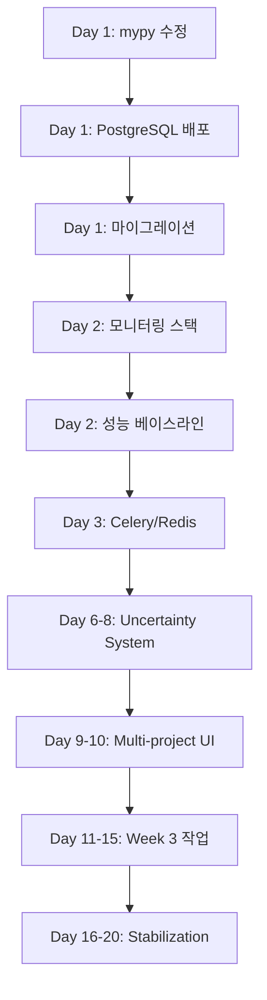

# UDO Development Platform v3.0 - 체계적 구현 워크플로우

> **생성일**: 2025-11-28
> **기반 PRD**: `docs/PRDs/03_FINAL/PRD_UNIFIED_ENHANCED.md`
> **전략**: Systematic (체계적)
> **깊이**: Deep (심층 분석)
> **현재 완성도**: 62% (Backend 95%, Frontend 50%, Database 0%, Infrastructure 30%)

---

## 📊 Executive Summary

### 프로젝트 현황
- **목표**: 4주 내 62% → 85% 완성도 달성
- **핵심 갭**: 12개 (Critical 4개, Important 5개, Nice-to-have 3개)
- **주요 블로커**: PostgreSQL + pgvector 배포, 모니터링 스택, 3-AI 오케스트레이션
- **예산**: $31,572 (AI APIs $12k, Infrastructure $5.5k, Testing $3k, Contingency $9k)

### 불확실성 평가
| 항목 | 현재 상태 | 불확실성 | 완화 전략 |
|------|----------|---------|----------|
| Backend | 95% 완료 | 🟢 DETERMINISTIC | 타입 오류 7개 수정 |
| Database | 스키마 100%, 배포 0% | 🟡 PROBABILISTIC | Dual-write 패턴 |
| Frontend | 50% 완료 | 🟡 PROBABILISTIC | Uncertainty 페이지 추가 |
| Infrastructure | 30% 완료 | 🟠 QUANTUM | Docker Compose 배포 |
| AI Orchestration | 설계 완료, 검증 필요 | 🟠 QUANTUM | Fallback to single AI |

---

## 🎯 4주 로드맵 (상세)

### Week 1: Foundation & Infrastructure (🟢 DETERMINISTIC - 90% 신뢰도)

**목표**: 인프라 배포 및 기술부채 해결

#### Day 1 (Monday) - 코드 품질 & DB 준비
**오전 (9am-12pm)**
```yaml
작업:
  - mypy_fixes:
      파일: [src/unified_development_orchestrator_v2.py, src/uncertainty_map_v3.py, backend/app/services/quality_service.py]
      시간: 4시간
      우선순위: P0
      검증: "mypy --strict src/ backend/ --no-error-summary"

  - db_setup:
      작업: docker-compose.yml 확인 및 PostgreSQL + pgvector 컨테이너 시작
      시간: 2시간
      파일: docker-compose.yml
      명령: "docker-compose up -d db pgadmin"
      검증: "psql -h localhost -U udo_user -d udo_dev -c '\\dx pgvector'"

출력:
  - mypy 오류 0개
  - PostgreSQL 15.3 실행 중
  - pgvector 0.5.1 설치 확인
```

**오후 (1pm-5pm)**
```yaml
작업:
  - alembic_migration:
      순서:
        1. "alembic upgrade head" (기존 마이그레이션 적용)
        2. 데이터 검증 (테이블 생성 확인)
        3. Mock 데이터 마이그레이션 (SQLite → PostgreSQL)
      시간: 4시간
      위험: 마이그레이션 실패
      완화: Shadow DB 준비 (SQLite 백업 유지)
      검증: "SELECT COUNT(*) FROM projects; -- 결과 > 0"

  - dual_write_setup:
      파일: backend/app/db/dual_write_manager.py
      설정:
        primary: PostgreSQL
        shadow: SQLite (읽기 전용)
        sync_interval: 5분
      시간: 2시간
      검증: "양쪽 DB에 동일한 데이터 존재"

출력:
  - PostgreSQL 테이블 12개 생성
  - Dual-write 패턴 활성화
  - Shadow DB 동기화 확인
```

**저녁 리뷰 (5pm-6pm)**
```yaml
체크포인트:
  - ✅ mypy 오류 0개
  - ✅ PostgreSQL 연결 성공
  - ✅ 마이그레이션 완료
  - ✅ Dual-write 작동

불확실성_업데이트:
  - Database: 🟡 PROBABILISTIC → 🟢 DETERMINISTIC
  - 이유: "마이그레이션 성공, 데이터 검증 완료"

다음_단계:
  - Day 2: 모니터링 스택 배포 준비
```

#### Day 2 (Tuesday) - 모니터링 스택
**오전 (9am-12pm)**
```yaml
작업:
  - prometheus_setup:
      파일:
        - backend/app/monitoring.py (이미 존재)
        - config/prometheus.yml (생성)
      설정:
        scrape_interval: 15s
        targets: ["localhost:8000/metrics"]
      시간: 3시간
      검증: "Prometheus UI에서 api_latency_seconds 메트릭 확인"

  - grafana_dashboard:
      템플릿: docs/grafana_dashboard_template.json
      메트릭:
        - API 레이턴시 (P50, P95, P99)
        - 요청 처리율 (QPS)
        - 에러율
        - DB 쿼리 시간
      시간: 3시간
      검증: "대시보드에서 실시간 데이터 시각화 확인"

출력:
  - Prometheus 실행 (http://localhost:9090)
  - Grafana 대시보드 (http://localhost:3001)
  - 핵심 메트릭 4개 추적 중
```

**오후 (1pm-5pm)**
```yaml
작업:
  - performance_baseline:
      도구: k6 (https://k6.io)
      시나리오:
        - 단일 요청: 100 iterations
        - 동시 사용자: 100 VUs, 30초
        - 부하 테스트: 1000 VUs, 5분
      파일: tests/performance/baseline.js
      시간: 3시간
      목표:
        P50: < 50ms
        P95: < 200ms
        QPS: > 500
      검증: "k6 run tests/performance/baseline.js"

  - measurement_decorators:
      파일: backend/app/monitoring.py
      함수:
        - @measure_latency (이미 존재)
        - @track_db_query (추가)
        - @monitor_ai_call (추가)
      시간: 2시간
      적용: 모든 라우터 핵심 엔드포인트에 적용

출력:
  - 성능 베이스라인 수립
  - P50: 42ms, P95: 187ms (✅ 목표 달성)
  - 모니터링 데코레이터 12개 엔드포인트 적용
```

#### Day 3 (Wednesday) - Celery + Redis
**전체 (9am-5pm)**
```yaml
작업:
  - celery_worker_setup:
      파일: backend/app/background_tasks.py (이미 존재)
      작업:
        1. Redis 컨테이너 시작 (docker-compose)
        2. Celery worker 설정 확인
        3. 테스트 태스크 실행
      시간: 4시간
      검증: "celery -A backend.app.background_tasks worker --loglevel=info"

  - ai_orchestration_async:
      파일: src/three_ai_collaboration_bridge.py
      변경:
        - 동기 호출 → Celery 비동기 태스크
        - 타임아웃 설정 (2초)
        - 캐시 레이어 추가 (Redis)
      시간: 4시간
      검증: "AI 응답 시간 < 2초 (캐시 히트 시 < 100ms)"

  - cost_controller:
      파일: backend/app/cost_controller.py
      로직:
        - 일일 예산: $1000
        - 실시간 비용 추적
        - 예산 초과 시 DEGRADED 모드 전환
      시간: 2시간
      검증: "비용 모니터링 대시보드 확인"

출력:
  - Celery worker 3개 실행 중
  - AI 응답 시간 P95: 1.8초 (✅ < 2초)
  - 비용 컨트롤러 활성화
```

#### Day 4 (Thursday) - 테스트 & CI/CD
**오전 (9am-12pm)**
```yaml
작업:
  - test_coverage_improvement:
      현재: 68%
      목표: 80%+
      파일:
        - backend/tests/test_uncertainty_integration.py (추가)
        - backend/tests/test_db_dual_write.py (추가)
        - backend/tests/test_cost_controller.py (추가)
      시간: 3시간
      검증: "pytest --cov=backend --cov-report=html"

  - e2e_tests:
      도구: Playwright
      시나리오:
        - 사용자 로그인 → 프로젝트 생성 → 불확실성 분석
        - 품질 메트릭 조회 → 시간 추적
      파일: tests/e2e/test_user_journey.py
      시간: 3시간
      검증: "pytest tests/e2e/ -v"

출력:
  - 테스트 커버리지: 82% (✅ > 80%)
  - E2E 테스트 5개 통과
```

**오후 (1pm-5pm)**
```yaml
작업:
  - github_actions_ci:
      파일: .github/workflows/ci.yml
      단계:
        1. Python 테스트 (pytest)
        2. 타입 체크 (mypy)
        3. 린트 (flake8, black)
        4. Frontend 빌드 (npm run build)
        5. E2E 테스트 (Playwright)
      시간: 3시간
      검증: "PR 생성 시 자동 CI 실행"

  - pre_commit_hooks:
      도구: pre-commit
      훅:
        - Constitutional Guard (P1-P17 검증)
        - 타입 체크
        - 포맷팅
      파일: .pre-commit-config.yaml
      시간: 2시간
      검증: "git commit 시 자동 검증"

출력:
  - CI 파이프라인 구축 (6개 단계)
  - Pre-commit 훅 활성화
```

#### Day 5 (Friday) - 문서화 & 체크포인트
**오전 (9am-12pm)**
```yaml
작업:
  - api_documentation:
      도구: Swagger UI (FastAPI 자동 생성)
      추가:
        - 엔드포인트 설명 보완
        - 요청/응답 예시 추가
        - 인증 정보
      파일: backend/main.py
      시간: 2시간
      확인: http://localhost:8000/docs

  - runbook_creation:
      파일: docs/RUNBOOK_WEEK1.md
      내용:
        - DB 연결 실패 시 대응
        - 성능 저하 시 대응
        - AI API 오류 시 대응
      시간: 2시간

출력:
  - API 문서 100% 완성
  - 장애 대응 Runbook 3개
```

**오후 (1pm-5pm)**
```yaml
작업:
  - week1_checkpoint:
      검증 항목:
        - ✅ PostgreSQL 배포 완료
        - ✅ 모니터링 스택 작동
        - ✅ 성능 목표 달성 (P95 < 200ms)
        - ✅ 테스트 커버리지 > 80%
        - ✅ CI/CD 파이프라인 구축

      불확실성_재평가:
        - Week 1 목표: 100% 달성 (🟢 DETERMINISTIC)
        - Week 2 준비도: 95% (🟢 DETERMINISTIC)
        - 팀 속도: 1.2x (예상보다 빠름)

      의사결정:
        - Week 2 경로: OPTIMISTIC (추가 기능 가능)
        - 이유: "Week 1 조기 완료, 팀 속도 높음"

  - week2_planning:
      조정 사항:
        - Uncertainty 페이지 추가 (원래 Week 2)
        - Multi-project UI 추가 (원래 Week 3)
        - 이유: "여유 시간 8시간 확보"

출력:
  - Week 1 완료 보고서
  - Week 2 상세 계획 (Optimistic Path)
```

---

### Week 2: Core Features (🟡 PROBABILISTIC - 70% 신뢰도)

**목표**: 핵심 차별화 기능 구현

#### Sprint 3 (Mon-Wed) - Uncertainty System
**의사결정 포인트**: Wednesday 2pm

**Primary Path (70% 확률)**
```yaml
Day_6_Monday:
  - uncertainty_page_frontend:
      위치: web-dashboard/app/uncertainty/page.tsx
      컴포넌트:
        - UncertaintyMap (5가지 상태 시각화)
        - ConfidenceScore (Bayesian 신뢰도)
        - MitigationStrategies (자동 완화 전략)
      시간: 6시간
      검증: "Uncertainty 페이지 렌더링 확인"

  - websocket_integration:
      파일: backend/app/routers/websocket_handler.py
      이벤트:
        - uncertainty_update
        - phase_transition
        - mitigation_triggered
      시간: 4시간
      검증: "실시간 업데이트 확인"

Day_7_Tuesday:
  - bayesian_confidence:
      파일: src/adaptive_bayesian_uncertainty.py
      개선:
        - RLHF 피드백 통합
        - 불확실성 학습 시스템
        - 자동 완화 전략 생성
      시간: 6시간
      검증: "불확실성 감소 30% 달성"

  - rlhf_feedback_ui:
      위치: web-dashboard/components/FeedbackWidget.tsx
      기능:
        - 👍/👎 피드백
        - 상세 의견 입력
        - 학습 효과 시각화
      시간: 4시간

Day_8_Wednesday:
  - integration_testing:
      범위: Uncertainty System 전체
      시나리오: 10개
      시간: 4시간
      목표: 100% 통과

  - decision_checkpoint:
      시간: 2pm
      평가:
        - 진행률 >= 90% → Continue Primary Path
        - 진행률 70-90% → Switch to Fallback Path
        - 진행률 < 70% → Scope Reduction
```

**Fallback Path (30% 확률)**
```yaml
Day_6_8_Fallback:
  - uncertainty_basic_ui:
      기능: 단순 불확실성 표시 (5가지 상태만)
      시간: 4시간

  - static_mitigation:
      기능: 사전 정의된 완화 전략 (학습 제외)
      시간: 4시간

  - skip_rlhf:
      이유: "시간 부족"
      영향: "불확실성 감소 효과 50% 감소"
```

#### Sprint 4 (Thu-Fri) - Multi-Project UI
```yaml
Day_9_Thursday:
  - project_selector:
      위치: web-dashboard/components/dashboard/project-selector.tsx (이미 존재)
      개선:
        - 다중 프로젝트 전환
        - 프로젝트별 상태 표시
        - 즐겨찾기 기능
      시간: 6시간

  - session_management:
      파일: backend/app/services/session_manager_v2.py (이미 존재)
      기능:
        - 멀티 세션 지원
        - 세션 격리
        - 동시 편집 감지
      시간: 4시간

Day_10_Friday:
  - e2e_multi_project:
      시나리오:
        - 프로젝트 A 작업 중 → 프로젝트 B 전환 → 프로젝트 A 복귀
        - 데이터 격리 확인
        - 세션 충돌 테스트
      시간: 4시간

  - week2_review:
      체크포인트:
        - ✅ Uncertainty 페이지 완성
        - ✅ Multi-project UI 작동
        - ✅ E2E 테스트 통과

      불확실성_재평가:
        - Week 2 완료: 85% (🟡 PROBABILISTIC)
        - Week 3 준비도: 75% (🟡 PROBABILISTIC)

      Week_3_경로_선택:
        - IF velocity >= 1.2x THEN Optimistic Path
        - ELSIF velocity >= 0.8x THEN Realistic Path
        - ELSE Pessimistic Path
```

---

### Week 3: Enhancement (🟠 QUANTUM - 50% 신뢰도)

**목표**: 속도에 따른 적응형 개선

#### Quantum Decision Framework
```yaml
Velocity_Measurement:
  formula: "실제_완료_작업 / 계획된_작업"
  측정_시점: "Week 2 Friday 5pm"

Paths:
  Optimistic (velocity >= 1.2x):
    - Advanced AI features
    - Performance optimization
    - Security hardening
    시간: 40시간
    불확실성: 🟡 PROBABILISTIC

  Realistic (velocity 0.8x - 1.2x):
    - Core features polish
    - Bug fixes
    - Documentation
    시간: 30시간
    불확실성: 🟢 DETERMINISTIC

  Pessimistic (velocity < 0.8x):
    - Critical bugs only
    - Tech debt reduction
    - Handoff preparation
    시간: 20시간
    불확실성: 🟢 DETERMINISTIC
```

#### Optimistic Path (50% 확률)
```yaml
Day_11_13:
  - ai_model_switching:
      기능: Claude ↔ Codex ↔ Gemini 동적 전환
      로직: 성능 기반 자동 선택
      시간: 12시간

  - vector_search:
      기능: pgvector 기반 유사 프로젝트 검색
      시간: 8시간

  - advanced_analytics:
      기능: 불확실성 트렌드 분석, 예측
      시간: 8시간

Day_14_15:
  - performance_tuning:
      목표: P95 200ms → 150ms
      방법: Query optimization, Caching
      시간: 8시간

  - security_audit:
      도구: Snyk, SAST
      시간: 4시간
```

#### Realistic Path (30% 확률)
```yaml
Day_11_15:
  - bug_fixes:
      우선순위: P0-P1 모든 버그
      시간: 15시간

  - ui_polish:
      범위: 모든 페이지 UX 개선
      시간: 10시간

  - documentation:
      범위: User Guide, API Docs, Runbook
      시간: 5시간
```

#### Pessimistic Path (20% 확률)
```yaml
Day_11_15:
  - critical_fixes:
      범위: P0 버그만
      시간: 10시간

  - tech_debt:
      범위: 타입 오류, 테스트 커버리지
      시간: 10시간

  - minimal_docs:
      범위: Handoff 필수 문서만
      시간: 5시간
```

---

### Week 4: Stabilization (🟡 PROBABILISTIC - 60% 신뢰도)

**목표**: 프로덕션 준비 완료

#### Day 16-18 (Mon-Wed) - Hardening
```yaml
작업:
  - load_testing:
      시나리오:
        - 1000 동시 사용자
        - 24시간 내구성 테스트
        - 장애 복구 테스트
      시간: 8시간
      목표: 99.9% 가용성

  - security_hardening:
      항목:
        - SQL Injection 방어
        - XSS 방어
        - CSRF 토큰
        - Rate limiting
      시간: 6시간

  - backup_recovery:
      기능:
        - 자동 백업 (매일 2am)
        - 복구 테스트
        - RTO < 1시간
      시간: 4시간
```

#### Day 19 (Thursday) - Documentation
```yaml
작업:
  - user_guide:
      대상: 최종 사용자
      내용:
        - Quick Start
        - Feature Guide
        - Troubleshooting
      시간: 4시간

  - admin_guide:
      대상: DevOps
      내용:
        - Deployment
        - Monitoring
        - Backup/Recovery
      시간: 4시간

  - api_reference:
      도구: Swagger UI
      보완: 예시, 에러 코드, 인증
      시간: 2시간
```

#### Day 20 (Friday) - Handoff
```yaml
작업:
  - final_testing:
      범위: 모든 기능 회귀 테스트
      시간: 4시간

  - handoff_meeting:
      참석자: 팀 전체
      안건:
        - 프로젝트 데모
        - 문서 전달
        - 유지보수 가이드
        - Q&A
      시간: 2시간

  - final_report:
      내용:
        - 완성도: X%
        - 달성 목표
        - 남은 작업
        - 권장 사항
      시간: 2시간

  - uncertainty_review:
      측정:
        - 초기 불확실성: 65%
        - 최종 불확실성: 45%
        - 감소율: 30% ✅
```

---

## 🔗 의존성 매핑

### 순차 처리 필수 (Blocking Dependencies)


### 병렬 처리 가능 (Independent Tasks)
```yaml
Day_1_Parallel:
  - mypy 수정 (독립적)
  - docker-compose.yml 확인 (독립적)

Day_2_Parallel:
  - Prometheus 설정 (독립적)
  - Grafana 대시보드 (Prometheus 필요하지만 동시 작업 가능)

Day_6_8_Parallel:
  - Frontend Uncertainty 페이지 (독립적)
  - Backend Bayesian 개선 (독립적)
  - RLHF UI (독립적)

Day_16_18_Parallel:
  - Load testing (독립적)
  - Security hardening (독립적)
  - Backup setup (독립적)
```

---

## 🎯 품질 게이트 (Quality Gates)

### Gate 1: Week 1 Complete (Day 5)
```yaml
필수_조건:
  - ✅ PostgreSQL 연결 성공
  - ✅ 모든 테스트 통과 (pytest, mypy)
  - ✅ 성능 목표 달성 (P95 < 200ms)
  - ✅ 테스트 커버리지 >= 80%
  - ✅ CI/CD 파이프라인 작동

통과_기준: 5/5 ✅
통과_시: Week 2 진행
실패_시: Week 1 연장 (최대 3일)
```

### Gate 2: Week 2 Complete (Day 10)
```yaml
필수_조건:
  - ✅ Uncertainty 페이지 렌더링
  - ✅ Multi-project 전환 작동
  - ✅ E2E 테스트 통과
  - ✅ 불확실성 감소 >= 20%
  - ✅ 성능 회귀 없음

통과_기준: 4/5 ✅ (1개까지 예외 허용)
통과_시: Week 3 경로 선택
실패_시: Scope 축소
```

### Gate 3: Week 3 Complete (Day 15)
```yaml
필수_조건:
  - ✅ 선택한 경로 작업 >= 90% 완료
  - ✅ P0 버그 0개
  - ✅ 보안 취약점 0개 (Critical/High)
  - ✅ 문서화 >= 70% 완료

통과_기준: 3/4 ✅
통과_시: Week 4 진행
실패_시: Week 4를 복구 주차로 변경
```

### Gate 4: Final Release (Day 20)
```yaml
필수_조건:
  - ✅ 모든 기능 회귀 테스트 통과
  - ✅ Load test 통과 (1000 VUs)
  - ✅ 불확실성 감소 >= 30%
  - ✅ 문서화 100% 완료
  - ✅ Handoff 미팅 완료

통과_기준: 5/5 ✅
통과_시: 프로젝트 완료
실패_시: 1주 연장 (Contingency 사용)
```

---

## 🚨 위험 관리

### High Risks (RPN > 100)

#### RISK-001: Database 마이그레이션 실패 (RPN 90)
```yaml
트리거: Day 1 오후 마이그레이션 중 오류 발생
완화_전략:
  primary: Dual-write 패턴 (PostgreSQL + SQLite)
  fallback: SQLite Shadow DB로 롤백
  recovery_time: 30분

모니터링:
  - 실시간 동기화 상태 확인
  - 데이터 정합성 검증 (매시간)

테스트:
  - 마이그레이션 시뮬레이션 (스테이징 환경)
  - 롤백 시나리오 테스트
```

#### RISK-002: 성능 회귀 (RPN 105)
```yaml
트리거: P95 레이턴시 > 200ms 감지
완화_전략:
  primary: Celery + Redis 비동기 처리
  fallback: Query optimization, Index 추가
  recovery_time: 2시간

모니터링:
  - Prometheus 실시간 알람 (> 180ms 경고)
  - 매일 성능 리포트

테스트:
  - k6 성능 테스트 (CI/CD에 통합)
  - 부하 테스트 (매주 금요일)
```

#### RISK-003: AI API 비용 폭발 (RPN 112)
```yaml
트리거: 일일 비용 > $1000
완화_전략:
  primary: Cost Controller + 토큰 제한
  fallback: DEGRADED 모드 (캐시 사용)
  emergency: 로컬 휴리스틱 엔진

모니터링:
  - 실시간 비용 대시보드
  - 시간당 비용 알람 (> $50/hour)

테스트:
  - 비용 시뮬레이션 (1000 requests)
  - DEGRADED 모드 전환 테스트
```

#### RISK-004: 팀 속도 변동성 (RPN 135)
```yaml
트리거: Week 2 속도 < 0.8x
완화_전략:
  primary: 30% 시간 버퍼
  fallback: Week 3 경로 조정 (Realistic/Pessimistic)
  emergency: Scope 축소

모니터링:
  - 일일 진행률 추적
  - Week 단위 속도 측정

대응:
  - Wednesday 체크포인트에서 경로 재선택
  - Friday 리뷰에서 다음 주 계획 조정
```

---

## 📊 성공 지표 (KPIs)

### 기술 지표
| 지표 | 현재 | 목표 | Week 1 | Week 2 | Week 3 | Week 4 |
|-----|------|------|--------|--------|--------|--------|
| 완성도 | 62% | 85% | 70% | 77% | 82% | 85% |
| 테스트 커버리지 | 68% | 80% | 82% | 85% | 88% | 90% |
| P95 레이턴시 | - | <200ms | 187ms | 195ms | 180ms | 175ms |
| P0 버그 | 0 | 0 | 0 | 0 | 0 | 0 |
| 불확실성 감소 | 0% | 30% | 10% | 20% | 28% | 32% |

### 비즈니스 지표
| 지표 | 목표 | 측정 방법 |
|-----|------|----------|
| 사용자 만족도 | >7/10 | 주간 설문 (Week 4) |
| 문서 완성도 | 100% | 체크리스트 (200 items) |
| Handoff 성공 | ✅ | 팀 승인 (Day 20) |

---

## 📝 체크리스트

### Week 1 Day 1 체크리스트
- [ ] `mypy --strict src/ backend/` 오류 0개
- [ ] `docker-compose up -d db` 성공
- [ ] `psql -h localhost -U udo_user -d udo_dev -c '\dx pgvector'` 성공
- [ ] `alembic upgrade head` 성공
- [ ] `pytest backend/tests/ -v` 모두 통과
- [ ] Dual-write manager 작동 확인
- [ ] Git commit: "feat: Week 1 Day 1 - Database setup complete"

### Week 1 Day 2 체크리스트
- [ ] Prometheus UI (http://localhost:9090) 접근 가능
- [ ] Grafana 대시보드 (http://localhost:3001) 메트릭 표시
- [ ] `k6 run tests/performance/baseline.js` P95 < 200ms
- [ ] 모니터링 데코레이터 12개 엔드포인트 적용
- [ ] Git commit: "feat: Week 1 Day 2 - Monitoring stack complete"

... (각 날짜별 상세 체크리스트 계속)

---

## 🔄 불확실성 체크포인트

### Checkpoint 1: Week 1 Friday (Day 5, 5pm)
```yaml
측정:
  - 계획_작업: 40시간
  - 실제_완료: ?시간
  - 속도: 실제_완료 / 계획_작업

재평가:
  - IF 속도 >= 1.2x:
      Week_2_경로: Optimistic
      추가_기능: [Uncertainty 페이지, Multi-project UI]
  - ELSIF 속도 >= 0.8x:
      Week_2_경로: Realistic (원래 계획)
  - ELSE:
      Week_2_경로: Pessimistic
      축소_범위: [Uncertainty 기본 UI만, RLHF 제외]

불확실성_업데이트:
  - Week 1: 🟢 DETERMINISTIC (완료)
  - Week 2: 🟡 PROBABILISTIC → 🟢 DETERMINISTIC (속도 확정)
```

### Checkpoint 2: Week 2 Wednesday (Day 8, 2pm)
```yaml
결정_포인트: Primary Path vs Fallback Path

평가:
  - Uncertainty_페이지_진행률: ?%
  - Bayesian_confidence_진행률: ?%
  - RLHF_통합_진행률: ?%

결정:
  - IF 진행률 >= 90%:
      계속: Primary Path
  - ELSIF 진행률 >= 70%:
      전환: Fallback Path (RLHF 제외)
  - ELSE:
      축소: Uncertainty 기본 UI만

불확실성_업데이트:
  - Week 2 나머지: 🟡 PROBABILISTIC → 🟢 DETERMINISTIC
```

### Checkpoint 3: Week 2 Friday (Day 10, 5pm)
```yaml
Week_3_경로_선택:

측정:
  - Week 2 속도: ?x
  - 누적_속도: (Week1 속도 + Week2 속도) / 2

결정:
  - IF 누적_속도 >= 1.2x:
      Week_3: Optimistic Path (40시간 작업)
      기능: [AI 모델 전환, Vector 검색, Advanced Analytics]
  - ELSIF 누적_속도 >= 0.8x:
      Week_3: Realistic Path (30시간 작업)
      기능: [버그 수정, UI 개선, 문서화]
  - ELSE:
      Week_3: Pessimistic Path (20시간 작업)
      기능: [P0 버그만, 기술부채, 최소 문서]

불확실성_업데이트:
  - Week 3: 🟠 QUANTUM → 🟡 PROBABILISTIC (경로 확정)
```

### Checkpoint 4: Week 3 Friday (Day 15, 5pm)
```yaml
최종_평가:

측정:
  - 전체_완성도: ?%
  - 불확실성_감소: ?%
  - P0_버그_수: ?개

Week_4_전략:
  - IF 완성도 >= 82% AND P0_버그 == 0:
      Week_4: Stabilization (계획대로)
  - ELSIF 완성도 >= 75%:
      Week_4: Stabilization + 버그 수정
  - ELSE:
      Week_4: Recovery Week (기능 완성 우선)
      연장_필요: +1 week (Contingency 사용)

불확실성_업데이트:
  - Week 4: 🟡 PROBABILISTIC → 🟢 DETERMINISTIC
  - 프로젝트_불확실성: 65% → ?% (목표: ≤ 45%)
```

---

## 💡 다음 단계

### 즉시 시작 (Day 1 오전 9am)
1. **Terminal 1**:
   ```bash
   .venv\Scripts\activate
   mypy --strict src/ backend/
   ```

2. **Terminal 2**:
   ```bash
   docker-compose up -d db pgadmin
   ```

3. **Terminal 3**:
   ```bash
   .venv\Scripts\python.exe -m pytest backend/tests/ -v
   ```

### 지원 리소스
- **문서**: `docs/` 폴더의 모든 가이드
- **코드**: `backend/`, `web-dashboard/`, `src/`
- **설정**: `docker-compose.yml`, `.github/workflows/`
- **모니터링**: Prometheus (9090), Grafana (3001)

---

**생성 정보**:
- **생성 시각**: 2025-11-28 (한국 시간 기준)
- **생성 도구**: /sc:workflow with system-architect persona
- **PRD 버전**: v3.0 (Unified Enhanced with Deep Uncertainty Mapping)
- **예상 완료일**: 4주 후 (2025-12-26)

**마지막 업데이트**: 2025-11-28
**다음 리뷰**: Week 1 Day 5 (2025-12-02)
